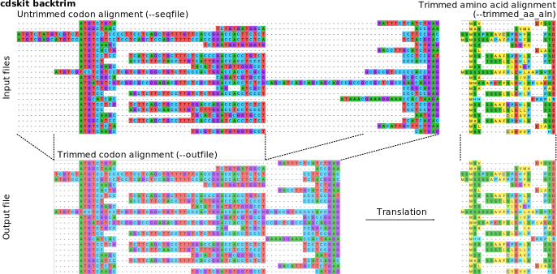

## Overview

**cdskit** is a pre- and post-processing tool for protein-coding nucleotide sequences. 
[All sequence formats supported by biopython](https://biopython.org/wiki/SeqIO) are available in this tool for both input and output.

## Dependency
* [python 3](https://www.python.org/)
* [biopython](https://biopython.org/)
* [numpy](http://www.numpy.org/)

## Installation
```
# Installation with pip
pip install git+https://github.com/kfuku52/cdskit

# This should show complete options if installation is successful
cdskit -h 
```

## Examples

### Making nucleotide sequences in-frame by N-padding

`cdskit pad --seqfile input.fasta --outfile output.fasta`

```
# input.fasta
>miss_1nt_5prime
TGCTAAGCGGTAATCTAAGCGGTAATTGA
>miss_2nt_5prime
GCTAAGCGGTAATCTAAGCGGTAATTGA
>miss_1nt_3prime
ATGCTAAGCGGTAATCTAAGCGGTAATTG
>miss_2nt_3prime
ATGCTAAGCGGTAATCTAAGCGGTAATT
>miss_1nt_both
TGCTAAGCGGTAATCTAAGCGGTAATTG
>miss_2nt_both
GCTAAGCGGTAATCTAAGCGGTAATT
>complete
ATGCTAAGCGGTAATCTAAGCGGTAATTGA
```

```
# output.fasta
>miss_1nt_5prime
NTGCTAAGCGGTAATCTAAGCGGTAATTGA
>miss_2nt_5prime
NNGCTAAGCGGTAATCTAAGCGGTAATTGA
>miss_1nt_3prime
ATGCTAAGCGGTAATCTAAGCGGTAATTGN
>miss_2nt_3prime
ATGCTAAGCGGTAATCTAAGCGGTAATTNN
>miss_1nt_both
NTGCTAAGCGGTAATCTAAGCGGTAATTGN
>miss_2nt_both
NNGCTAAGCGGTAATCTAAGCGGTAATTNN
>complete
ATGCTAAGCGGTAATCTAAGCGGTAATTGA
```

### Extracting longest sequences among isoforms using regular expression

`cdskit aggregate --seqfile input.fasta --outfile output.fasta --expression ":.*" "\|.*"`

```
# input.fasta
>seq1:1.length=30nt
ATGCTAAGCGGTAATCTAAGCGGTAATTGA
>seq1:2.length=27nt
ATGCTAAGCGGTAATCTAAGCGGTTGA
>seq1:3.length=33nt
ATGCAACTAAGCGGTAATCTAAGCGGTAATTGA
>seq2|1.length=45nt
ATGTCGGAATTGCGAGTAAGCACCAGCTTCTCAAAACCAAAATAA
>seq2|2.length=54nt
ATGTCGAGATCCCGAGAATTGCGAGTAAGCACCAGCTTCTCAAAACCAAAATAA
```

```
# output.fasta
>seq1:3.length=33nt
ATGCAACTAAGCGGTAATCTAAGCGGTAATTGA
>seq2|2.length=54nt
ATGTCGAGATCCCGAGAATTGCGAGTAAGCACCAGCTTCTCAAAACCAAAATAA
```
### Masking ambiguous and/or stop codons
`cdskit mask --seqfile input.fasta --outfile output.fasta`

```
# input.fasta
>stop
---ATGTAAATTATGTTGAAG---
>ambiguous1
---ATGTNAATTATGTTGAAG---
>ambiguous2
---ATGT-AATTATGTTGAAG---
>all
---ATGTAAATT--GTTGANG---
```

```
# output.fasta
>stop
---ATGNNNATTATGTTGAAG---
>ambiguous1
---ATGNNNATTATGTTGAAG---
>ambiguous2
---ATGNNNATTATGTTGAAG---
>all
---ATGNNNATTNNNTTGNNN---
```

## Back-translating trimmed protein alignment
`cdskit backtrim --seqfile untrimmed_codon.fasta --trimmed_aa_aln trimmed_protein.fasta --outfile trimmed_codon.fasta`



## Hammer down long sequences
`cdskit hammer --seqfile input.fasta --outfile output.fasta --nail 4`

```
# input.fasta
>seq1
---ATGTAAATTATGTTGAAG---TGATGA---
>seq2
---ATGTNAATTATGTTGAAG---TATTGA---
>seq3
---ATGTGAATTATGTTGAAG---TATTGA---
>seq4
---ATGTAAATT---TTGANG---TATTGATTTTCATCA
>seq5
---ATGTAAATTATGTTGANG---TATTGATTTTCATCA
>seq6
---ATGTAAATT---TTGANG---TATTGATTTTCATCA
```

```
# output.fasta
>seq1
ATGATTATGTTGTGA
>seq2
ATGATTATGTTGTAT
>seq3
ATGATTATGTTGTAT
>seq4
ATGATT---TTGTAT
>seq5
ATGATTATGTTGTAT
>seq6
ATGATT---TTGTAT
```
### Pipe for streamlined analysis
The streamlined processing may be combined with other sequence processing tools such as [SeqKit](https://bioinf.shenwei.me/seqkit/).
```
cat input.fasta \
| cdskit pad \
| cdskit mask \
| cdskit aggregate \
> output.fasta
```

# Licensing
This program is BSD-licensed (3 clause). See [LICENSE](LICENSE) for details.

