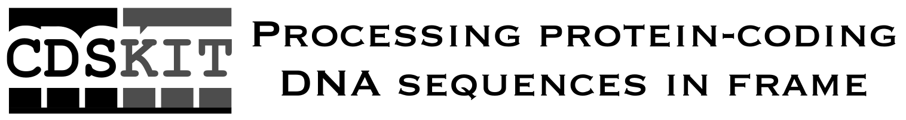

[](https://github.com/kfuku52/cdskit/actions/workflows/test.yml)
[](https://github.com/kfuku52/cdskit/releases)
[](https://anaconda.org/bioconda/cdskit)
[](https://github.com/kfuku52/cdskit)
[](https://anaconda.org/bioconda/cdskit)
[](https://anaconda.org/bioconda/cdskit)
[](https://opensource.org/licenses/BSD-3-Clause)

## Overview
**CDSKIT** is a Python toolkit for processing protein-coding DNA sequences.
Most transformations work in codon units to preserve the reading frame.
Input and output format names follow [Biopython SeqIO](https://biopython.org/wiki/SeqIO),
but output formats must support the annotations left after a transformation.
Use FASTA for translation and length-changing operations unless the destination
format's required annotations are preserved.

## Installation
The current source requires **Python 3.10 or newer** and is tested on 3.10–3.14.
Stable packages are available from [Bioconda](https://anaconda.org/bioconda/cdskit);
`master` can contain newer changes. With conda or
[Miniforge](https://github.com/conda-forge/miniforge), create an environment using
[Bioconda's channel order](https://bioconda.github.io/index.html#with-conda):

```bash
conda create -n cdskit -c conda-forge -c bioconda --strict-channel-priority \
  cdskit 'python>=3.10' 'biopython>=1.80' 'numpy>=1.23' 'matplotlib-base>=3.6'
conda activate cdskit
cdskit --help
```

The explicit dependencies compensate for omissions in the Bioconda 0.27.0
recipe; see [installation notes](wiki/Installation-and-dependencies.md).

Install the latest source from GitHub into an activated Python environment:

```bash
python -m pip install --upgrade 'cdskit @ git+https://github.com/kfuku52/cdskit.git'
```

For neural training and prediction, install the optional
`ml` extra (`torch`, `scikit-learn`, and `transformers`):

```bash
python -m pip install --upgrade 'cdskit[ml] @ git+https://github.com/kfuku52/cdskit.git'
```

CDSKIT is not published on PyPI; include the GitHub URL in pip commands.
Lightweight centroid JSON models need only the base installation. Pretrained
localization models run on CPU; a GPU is not required for prediction.
Published `targeting5` model artifacts additionally require their original
scikit-learn environment; follow the
[pretrained runtime setup](wiki/Installation-and-dependencies.md#pretrained-targeting5-runtime).

## Subcommands
See [Wiki](https://github.com/kfuku52/cdskit/wiki) for detailed descriptions.

- [`accession2fasta`](https://github.com/kfuku52/cdskit/wiki/cdskit-accession2fasta): Retrieving fasta sequences from a list of GenBank accessions
- [`aggregate`](https://github.com/kfuku52/cdskit/wiki/cdskit-aggregate): Extracting the longest sequences combined with a sequence name regex
- [`backalign`](https://github.com/kfuku52/cdskit/wiki/cdskit-backalign): Back-aligning CDS from unaligned CDS + aligned proteins
- [`backtrim`](https://github.com/kfuku52/cdskit/wiki/cdskit-backtrim): Back-translating a trimmed protein alignment
- [`codonstats`](https://github.com/kfuku52/cdskit/wiki/cdskit-codonstats): Printing codon-aware per-sequence and aggregate codon-usage statistics
- [`degeneracy`](https://github.com/kfuku52/cdskit/wiki/cdskit-degeneracy): Extracting aligned 0/2/3/4-fold degenerate nucleotide positions
- [`filter`](https://github.com/kfuku52/cdskit/wiki/cdskit-filter): Filtering CDS by sequence-level quality rules
- [`gapjust`](https://github.com/kfuku52/cdskit/wiki/cdskit-gapjust): Adjusting consecutive Ns to the fixed length
- [`hammer`](https://github.com/kfuku52/cdskit/wiki/cdskit-hammer): Removing less-occupied codon columns from a gappy alignment
- [`intersection`](https://github.com/kfuku52/cdskit/wiki/cdskit-intersection): Dropping non-overlapping sequence labels between two sequences files or between a sequence file and a gff file
- [`label`](https://github.com/kfuku52/cdskit/wiki/cdskit-label): Modifying sequence labels
- [`longestorf`](https://github.com/kfuku52/cdskit/wiki/cdskit-longestorf): Finding the longest ORF by six-frame translation (+/- strands, 3 frames each)
- [`localize`](https://github.com/kfuku52/cdskit/wiki/cdskit-localize): Predicting targeting peptide classes (`noTP`, `SP`, `mTP`, `cTP`, `lTP`) or compatible multi-label localization models from CDS or protein input
- [`localize-learn`](https://github.com/kfuku52/cdskit/wiki/cdskit-localize-learn): Training custom localization models from TSV or UniProt-derived labels
- [`mask`](https://github.com/kfuku52/cdskit/wiki/cdskit-mask): Masking ambiguous and/or stop codons
- [`maxalign`](https://github.com/kfuku52/cdskit/wiki/cdskit-maxalign): Removing sequences to maximize codon-based alignment area ([MaxAlign](https://link.springer.com/article/10.1186/1471-2105-8-312))
- [`pad`](https://github.com/kfuku52/cdskit/wiki/cdskit-pad): Making nucleotide sequences in-frame by head and tail paddings
- [`parsegb`](https://github.com/kfuku52/cdskit/wiki/cdskit-parsegb): Converting the GenBank format
- [`plot`](https://github.com/kfuku52/cdskit/wiki/cdskit-plot): Plotting aligned CDS summaries, codon-state maps, or nucleotide alignment views with consensus codon/AA and AA frequency logos using matplotlib (`--mode summary|map|msa`; default output is PDF, override with `--format`)
- [`printseq`](https://github.com/kfuku52/cdskit/wiki/cdskit-printseq): Print a subset of sequences with a regex
- [`rmseq`](https://github.com/kfuku52/cdskit/wiki/cdskit-rmseq): Removing a subset of sequences by using a sequence name regex and by detecting problematic sequence characters
- [`split`](https://github.com/kfuku52/cdskit/wiki/cdskit-split): Splitting 1st, 2nd, and 3rd codon positions
- [`stats`](https://github.com/kfuku52/cdskit/wiki/cdskit-stats): Printing sequence statistics
- [`translate`](https://github.com/kfuku52/cdskit/wiki/cdskit-translate): Translating CDS nucleotide sequences to amino acids
- [`trimcodon`](https://github.com/kfuku52/cdskit/wiki/cdskit-trimcodon): Trimming aligned CDS codon columns by clean-codon fraction
- [`validate`](https://github.com/kfuku52/cdskit/wiki/cdskit-validate): Validating aligned CDS quality and reporting issues

`longestcds` remains a deprecated alias of `longestorf`.

## Command-line use

Sequence commands accept standard input and output, so they can be piped:

```bash
cdskit pad --seq_file input.fasta | cdskit mask | cdskit translate | \
  cdskit aggregate --expression ':.*' > output.faa
```

Run `cdskit COMMAND --help` for options and defaults. Commands with parallel work
expose `--threads`: the default is `1`, and `0` detects CPUs up to the configured
safety limit (64 by default). Small workloads can still run serially. See
[resource limits](wiki/Installation-and-dependencies.md#parallel-work-and-resource-limits).

## CLI and TSV conventions

Long options use snake_case consistently, for example `--seq_file`,
`--out_file`, `--codon_table`, and `--seq_name_regex`. Older compact names
remain accepted for backward compatibility, but print a deprecation warning
that names the replacement. Boolean values consistently accept
`yes/no`, `true/false`, `on/off`, and `1/0`.

Structured TSV report files are UTF-8, tab-delimited, rectangular, and written with LF
line endings. Input tables must have a unique, non-empty header and all
columns required by the selected operation. Shared biological columns use
`accession`, `sequence`, `organism_group`, `localization`, `peroxisome`, and
`fold_id`. Peroxisome values are written as `yes` or `no`. Multi-part TSV
reports use one header, a `schema_version` column, and a `section` column
instead of concatenating tables with different widths. Versioned reports
currently use schema version `2` on every row. See [the 0.24 migration
guide](MIGRATION.md) for the old-to-new CLI and TSV mappings and
[the changelog](CHANGELOG.md) for release details.

`codonstats --mode both` is a human-readable concatenation of two tables, not
one TSV table. Use `--mode summary` or `--mode usage` for machine-readable output.

## Localization guides

See the [prediction guide](wiki/cdskit-localize.md) for pretrained aliases,
report columns, offline use, and safe model loading; the
[training guide](wiki/cdskit-localize-learn.md) covers custom models and CV.
[Benchmark notes](wiki/cdskit-localize-benchmarks-and-notes.md) distinguish
historical model results from current reproducibility requirements.

## Development and tests

The dependency-light development loop runs unit and integration tests without
loading optional ML frameworks:

```bash
python scripts/check.py quick
```

The committed `uv.lock` is the reproducible development and CI resolution.
Package consumers can continue to install cdskit with pip; the lock is not an
upper-bound policy for the library's declared compatibility ranges.

See [TESTING.md](TESTING.md) for the ML, coverage, quality, package, and focused
rerun commands, CPU benchmarks, and fixture conventions. See
[documentation maintenance](docs/documentation.md) for wiki updates and publication.

## Citation
For a published application of CDSKIT, see
[Fukushima & Pollock (2023, Nat Ecol Evol 7: 155–170)](https://www.nature.com/articles/s41559-022-01932-7).
Its Methods describe the use of `pad`, `mask`, `backtrim`, and `hammer`.


## Licensing
This program is BSD-licensed (3 clause). See [LICENSE](LICENSE) for details.
