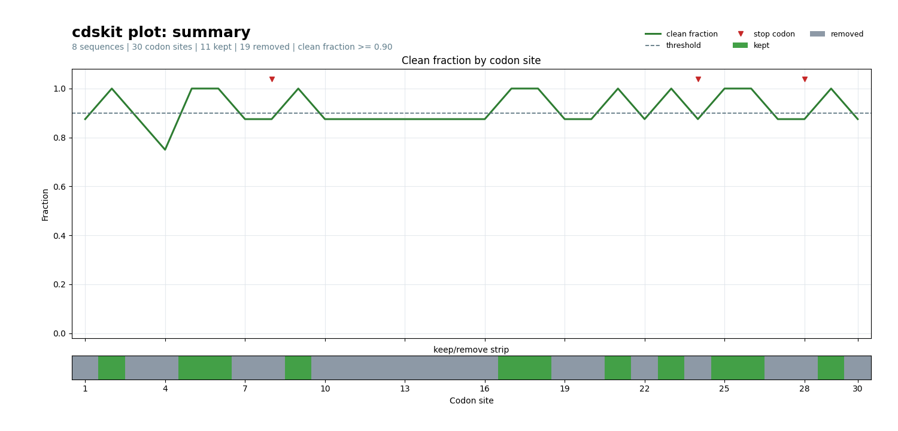
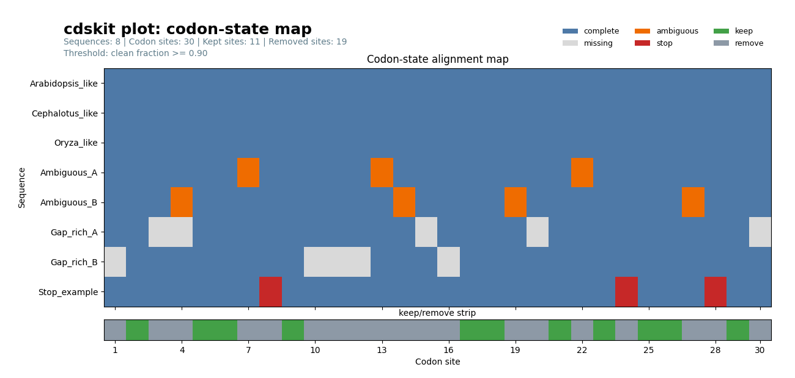
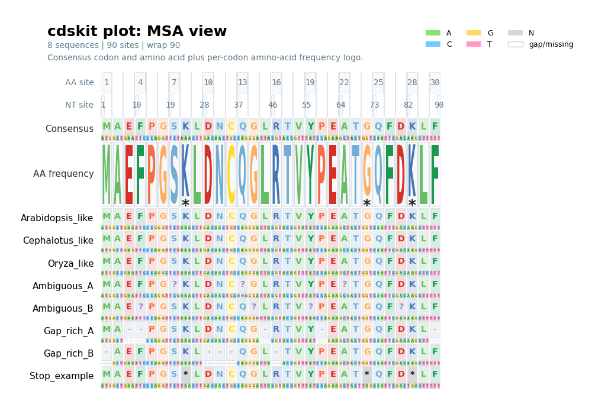

# cdskit plot

`cdskit plot` renders codon-aware visual summaries from aligned CDS data. The command supports three plotting modes:

- `summary`: Alignment-level QC summary with a clean-fraction line, threshold overlay, stop-codon markers, and a keep/remove strip.
- `map`: Sequence-by-site codon-state map that highlights complete, missing, ambiguous, and stop codons.
- `msa`: Nucleotide alignment view with amino-acid site numbers, nucleotide site numbers, consensus amino acid/codon rows, and a per-codon amino-acid frequency logo.

The default output format is PDF. Use `--format pdf|svg|png`, or let `--out_file` decide the format automatically from its filename extension.

## Examples

The images are saved previews of an illustrative eight-sequence alignment,
with custom figure dimensions. The commands below show the corresponding
modes; your own `alignment.fasta` determines the plotted values and labels.

### Summary plot

```bash
cdskit plot --seq_file alignment.fasta --mode summary --out_file qc-summary.pdf --min_clean_fraction 0.9
```

This mode is useful for choosing a clean-codon fraction threshold before trimming.



### Codon-state map

```bash
cdskit plot --seq_file alignment.fasta --mode map --out_file codon-map.svg --format svg --min_clean_fraction 0.9
```

This mode shows how each sequence behaves at each codon site and includes the keep/remove strip derived from the same clean-fraction threshold used by `trimcodon`.



### MSA view

```bash
cdskit plot --seq_file alignment.fasta --mode msa --out_file alignment-view.pdf --wrap 90
```

This mode draws the nucleotide alignment as codon-aware blocks. Each sequence row is split into amino-acid and codon panels, and the consensus plus AA-frequency logo are shown above the alignment. `--wrap` must be a multiple of three; the preview uses `90`, while the default is `60`.



## Common options

- `--out_file PATH`: Output plot path. Use `-` for standard output.
- `--format auto|pdf|svg|png`: Output format. If `auto` is used, the format is inferred from `--out_file`; otherwise PDF is used by default.
- `--width INT`, `--height INT`: Figure size in pixels.
- `--title STR`: Optional plot title.
- `--codon_table INT`: NCBI codon table ID.
- `--threads INT`: Number of worker threads for data preparation.

## Threshold-related options

- `--min_clean_fraction FLOAT`: Minimum fraction of sequences with a clean codon required to keep a codon site in `summary` and `map`.

A clean codon contains no missing character (`-`, `?`, or `.`), no ambiguous nucleotide (`N`, `R`, `Y`, etc.), and no unambiguous stop codon.

## Layout options

- `--row_height INT`: Row height for `map` and `msa`.
- `--label_width INT`: Width reserved for sequence labels in `map` and `msa`.
- `--wrap INT`: Number of nucleotide columns per block in `msa`. Must be divisible by three.
- `--top_n INT`: Number of high-ambiguity sequences shown in the side bar chart for `summary` and `map`. The default is `0`, which hides the side chart.

## Input requirements

- Input sequences must be DNA.
- All sequences must already be aligned.
- Sequence lengths must be multiples of three.

## Notes

- `summary` and `map` are useful for alignment QC and trimming decisions.
- `msa` is designed for compact codon-aware visualization of moderate-length alignments.
- The plotting backend uses `matplotlib`, so PDF, SVG, and PNG output are available from the same command.
